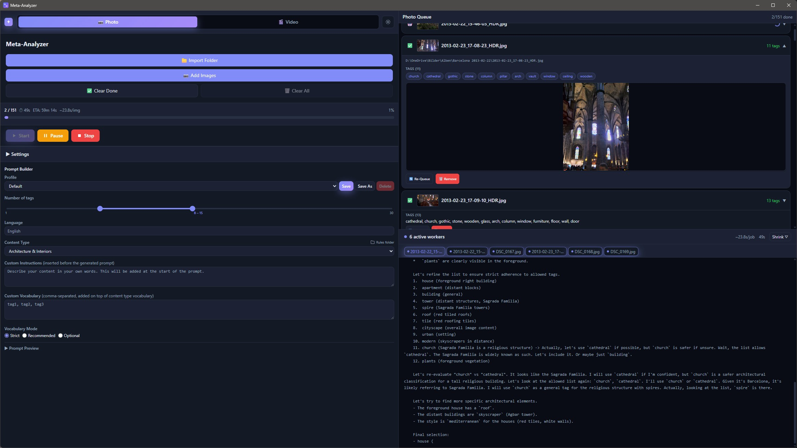

<h1 align="center">Meta-Analyzer</h1>

<p align="center"><b>AI-powered metadata tagger for your photo and video library.</b></p>

<p align="center">
  <a href="LICENSE"></a>
  
  <a href="https://github.com/b14ckyy/Meta-Analyzer/releases/latest"></a>
  <a href="docs/user-guide.md"></a>
  <a href="https://paypal.me/b14ckyy"></a>
</p>

Meta-Analyzer is a local-first desktop app that looks at your images and videos
with a **vision LLM** and writes descriptive tags (and, for videos, a title,
description and genres) straight into the file's metadata — so your media becomes
searchable in tools like Plex, digiKam or your OS file search.

It runs entirely against a **local, OpenAI-compatible** model server (e.g.
[LM Studio](https://lmstudio.ai/)) by default — your files never leave your
machine. An optional API key lets you point it at a private/cloud server instead.

Built with **Tauri 2 · Svelte 5 · Rust**.

<p align="center">
  
</p>

---

## Features

- **Photos & videos** — two pipelines sharing one engine.
  - Photos: tags written to **EXIF / IPTC / XMP**.
  - Videos: **title, description, genres and tags** written to MP4/MKV/AVI
    containers via `ffmpeg`; frames sampled from an embedded cover or evenly
    across the clip.
- **Local-first** — talks to any OpenAI-compatible `/v1/chat/completions` endpoint
  (LM Studio, etc.). Optional Bearer **API key** for private/cloud servers.
- **Content-type profiles** — General and Custom are built in; every other
  category is an **editable JSON rule file** (`image_*` / `video_*`) that is
  discovered at runtime. Drop in your own or share them — a *Rules folder* button
  opens the directory.
- **Prompt Builder** — per-profile control over tag count, output **language**
  (with a strict translation directive + English fallback), **vocabulary mode**
  (Strict / Recommended / Optional), extra custom vocabulary and free-text
  **custom instructions**.
- **Batch processing** — worker pool with configurable concurrency,
  pause / resume / stop, live token-streaming "thinking" panel per worker, and
  an ETA timer.
- **Review or automate** — auto-apply results, or edit the title, description,
  tags and genres inline before writing.
- **Quality-of-life** — light/dark theme, drag & drop, inline thumbnails,
  model favourites, toasts, and reveal-in-Explorer.

---

## Requirements

- A running **OpenAI-compatible vision model** (default: LM Studio with a
  vision-capable model loaded).
- **`ffmpeg` / `ffprobe`** on your `PATH` (or next to the executable) — required
  for video frame extraction and metadata writing. Not needed for photo-only use.
- Windows (primary target). The stack is cross-platform via Tauri; other
  platforms are untested.

## Model recommendations

Output quality depends heavily on the model you run. Notes from testing:

- **Vision is mandatory** — the model must be able to *see* images (a
  vision/multimodal model). Text-only models will not work.
- **Reasoning is recommended** — reasoning-capable models produce noticeably
  more reliable results and stick to the required JSON format far better.
- **You own the model configuration** — Meta-Analyzer only sends the requests.
  The number of parallel workers is ultimately bounded by your **LM Studio**
  (server) settings, and it is up to you to load and configure your model so it
  runs *stably* under batch load (context length, GPU layers, parallel request
  limits, etc.).

**Recommended — reliable JSON output + strong analysis:**

- **Qwen3.5 9B** — Q6 or higher
- **Mistral 3 14B** — Q4 or higher

**Faster, but notably less accurate:**

- **Qwen2 7B (Q8), no reasoning** — fast, but makes more mistakes and does not
  always return valid JSON.

The prompt generator and the built-in presets were tuned and tested mainly
against **Qwen3.5** and **Mistral 3**. **Cloud providers are untested** for
output quality.

## Getting started (development)

```bash
npm install
npm run tauri dev
```

Point the app at your model server URL (default `http://localhost:1234/v1`),
pick a model, choose a content type, and start.

## Building

```bash
npm run tauri build
```

---

## Tech stack

| Layer      | Tech |
| ---------- | ---- |
| Shell      | Tauri 2 (Rust) |
| Frontend   | Svelte 5 (runes) · TypeScript · Vite · TailwindCSS |
| Backend    | Rust — `reqwest` (SSE streaming), `tokio`, `little_exif` / `img-parts` / `image`, `ffmpeg` (external) |
| Model API  | OpenAI-compatible `/v1/chat/completions` |

## Documentation

- **[User Guide](docs/user-guide.md)** — install, first-run setup, tagging photos & videos.
- Visual walkthroughs — **[Interface](docs/interface-overview.md)** · **[Tagging Photos](docs/tagging-photos.md)** · **[Tagging Videos](docs/tagging-videos.md)**
- **[Developer docs](docs/dev/)** — architecture, build, data flow, prompt builder, metadata format.

## License

Meta-Analyzer is free software licensed under the
**[GNU General Public License v3.0](LICENSE)** or later.

It is distributed in the hope that it will be useful, but **WITHOUT ANY
WARRANTY**. See the [LICENSE](LICENSE) file for the full terms.
