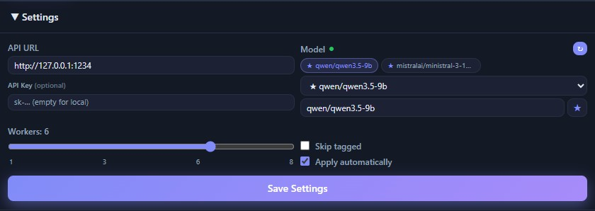

# Interface Overview

A quick tour of the Meta-Analyzer window. For the step-by-step workflow see the
[User Guide](user-guide.md); for the photo and video specifics see
[Tagging Photos](tagging-photos.md) and [Tagging Videos](tagging-videos.md).

The window is split into a **control column** on the left and the **queue** on the
right.

**Top bar**
- **Photo / Video** toggle — switches the whole app between the two modes (file
  picker, queue and settings all follow).
- **Theme** button (sun/moon) — light/dark.

**Left column — controls**
- **Import Folder / Add Images** — add media to the queue. The file picker is
  filtered to the current mode (images vs. videos). Drag & drop works too.
- **Clear Done / Clear All** — remove finished jobs, or empty the queue.
- **Progress + ETA** — jobs completed, elapsed time, estimated time remaining and
  average time per item.
- **Start / Pause / Stop** — run the batch; pause/resume the workers; stop (jobs
  stay in the queue).
- **Settings** — app settings (see below), collapsed by default.
- **Prompt Builder** — the active profile that controls how tags are generated
  (see [Tagging Photos](tagging-photos.md)).

**Right column — queue & workers**
- Each row is one file with its thumbnail, name and status. Finished rows show the
  tag count and expand to reveal the tags, an inline preview and **Re-Queue /
  Remove**.
- The **active workers** panel at the bottom shows one tab per running job and
  streams the model's live reasoning/output as it works.

---

## App settings

Open the **Settings** fold-down (shown here in Photo mode; Video mode adds a few
extra options — see [Tagging Videos](tagging-videos.md)).

- **API URL** — your model server, e.g. `http://127.0.0.1:1234` (LM Studio's
  default). The green dot next to **Model** means the server is reachable.
- **API Key** *(optional)* — only needed for a private/cloud OpenAI-compatible
  server; leave empty for a local one.
- **Model** — pick the loaded model. The refresh button reloads the list; the
  **★** pins favourites to the top (like in LM Studio).
- **Workers** — how many images are processed in parallel.
- **Skip tagged** — skip files that already contain tags.
- **Apply automatically** — write results immediately, or leave off to review and
  edit before writing.
- **Save Settings** — persists the app settings (the Prompt Builder is saved
  separately, as a profile).
