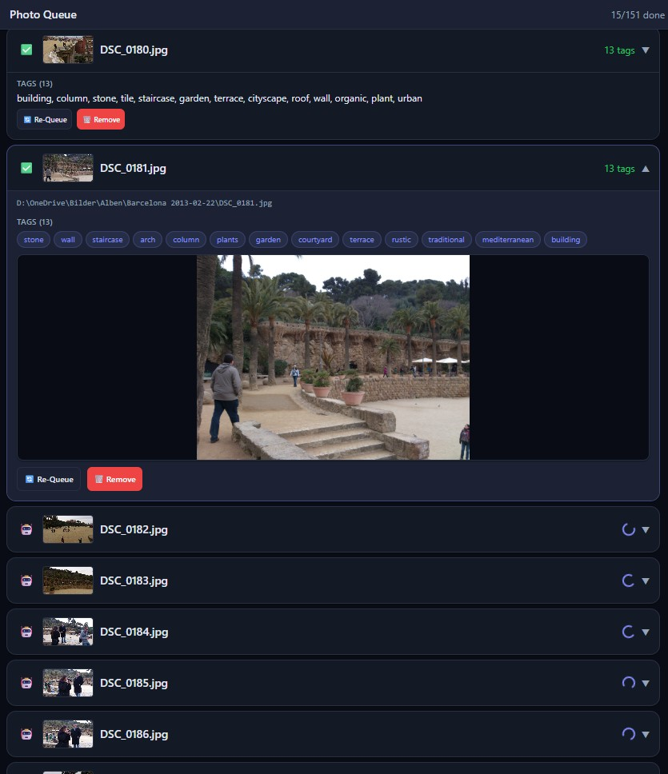
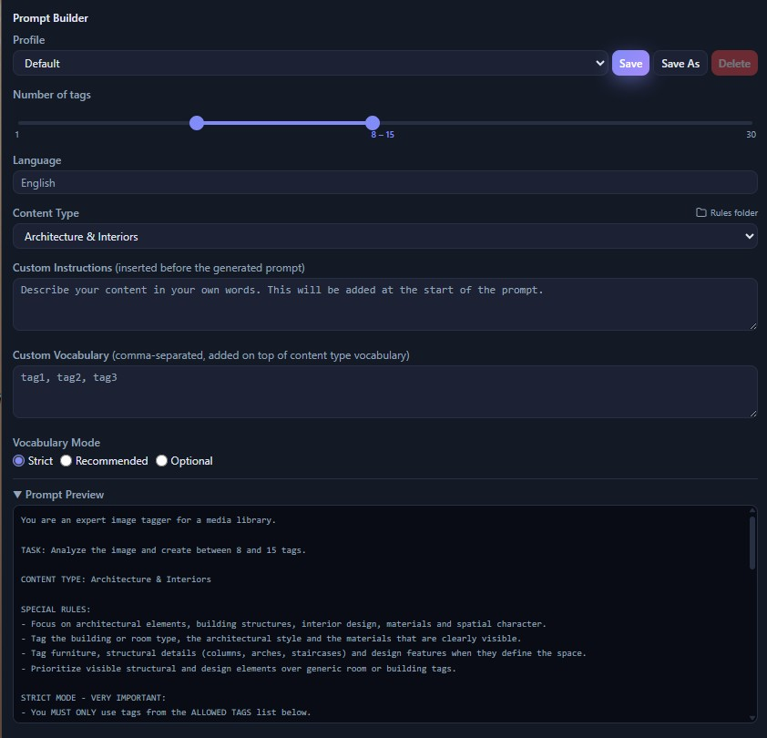

# Tagging Photos

Switch to **Photo** mode, add images (Import Folder / Add Images / drag & drop),
pick a **Content Type**, and press **Start**. See the
[Interface Overview](interface-overview.md) for the surrounding controls.

## The photo queue

Each file is a row in the queue:

- **Pending / processing** rows show a spinner; **done** rows show a green check
  and the tag count (e.g. *13 tags*).
- Click a row to **expand** it: the full file path, the generated **tags** (as
  chips or a comma list) and an **inline preview** of the image.
- **Re-Queue** runs the file again (e.g. after changing the profile);
  **Remove** drops it from the queue.
- The thumbnail is clickable to reveal the file in Explorer, and tags can be
  copied.

When **Apply automatically** is on, tags are written to the file as each job
finishes. With it off, results wait for you to review — then apply them.

Tags are written to **EXIF / IPTC / XMP**, so Plex, Jellyfin, digiKam, Lightroom
and Windows search all pick them up.

## The Prompt Builder

The Prompt Builder is the **profile** that decides how the model tags your images.
Everything here feeds the prompt shown live in **Prompt Preview**.

- **Profile** — save several setups and switch between them (Save / Save As /
  Delete).
- **Number of tags** — the min–max range the model aims for.
- **Language** — the output language for the tags (translated automatically, with
  an English fallback if the model isn't fluent).
- **Content Type** — the category whose rules and vocabulary are used (here
  *Architecture & Interiors*). The **Rules folder** button opens the folder where
  these editable category files live — drop in your own or shared packs and they
  appear in the dropdown.
- **Custom Instructions** — free-text guidance inserted near the top of the
  prompt.
- **Custom Vocabulary** — extra comma-separated tags added on top of the
  category's list.
- **Vocabulary Mode**
  - **Strict** — use only the allowed tags,
  - **Recommended** — prefer them, add others if needed,
  - **Optional** — the list is just a suggestion.
- **Prompt Preview** — the exact prompt that will be sent, assembled from all of
  the above (role, task, content-type special rules, vocabulary mode, allowed
  tags …).
