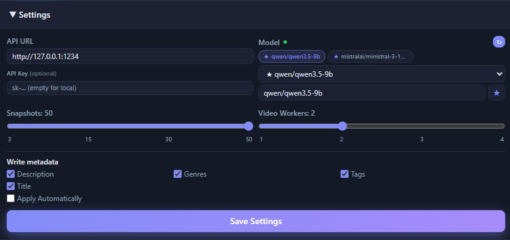
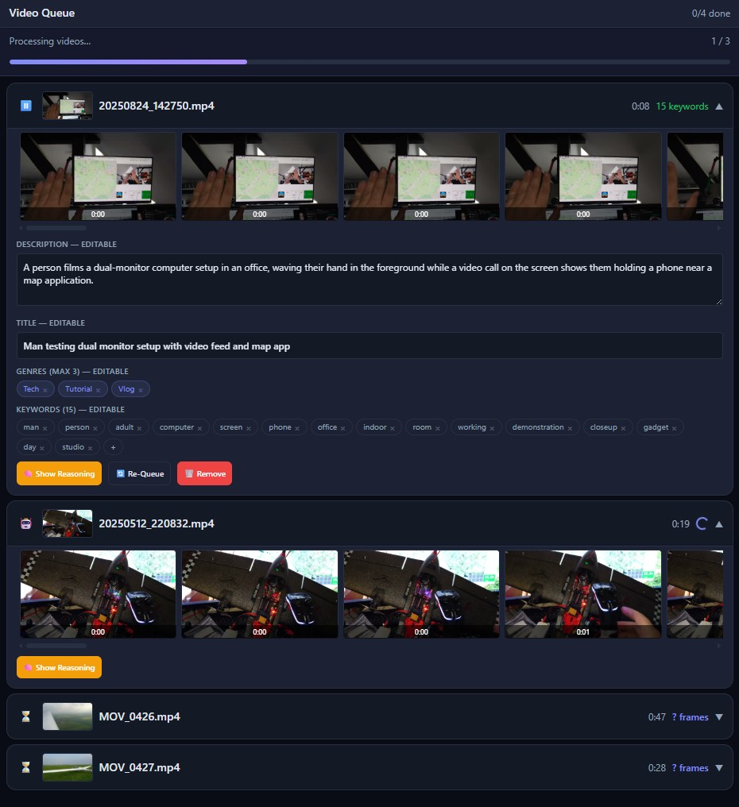

# Tagging Videos

Switch to **Video** mode and add video files. Meta-Analyzer samples still frames
from each clip, analyzes them together, and produces a **title**, a
**description**, **genres** and **keywords** — then writes them into the file with
ffmpeg (no re-encode). Video mode needs `ffmpeg` and `ffprobe` available (next to
the app or on your `PATH`).

## Video settings

In **Video** mode the Settings fold-down adds a few options:

- **Snapshots** — how many frames are sampled per video (more = better coverage,
  slower). Frames are taken from an embedded cover or evenly across the clip.
- **Video Workers** — how many videos are processed in parallel (1–4; frame
  extraction is disk/CPU heavy, so keep it modest).
- **Write metadata** — choose which fields are written back: **Description**,
  **Genres**, **Tags**, **Title**.
- **Apply Automatically** — write immediately, or leave off to review/edit first.

API URL, API Key, Model and the favourites work exactly as in
[the interface overview](interface-overview.md).

## The video queue

A finished row expands to show everything the model produced, all **editable**
before writing:

- The **frame filmstrip** — the sampled snapshots the analysis was based on.
- **Description** — a short summary of the clip.
- **Title** — a generated title.
- **Genres (max 3)** — removable chips (click the × to drop one).
- **Keywords** — removable chips, with **+** to add your own.
- **Show Reasoning** opens the model's full thought process; **Re-Queue** re-runs
  the video; **Remove** drops it.

Rows still working show a spinner and their live frame strip; pending rows show an
hourglass and their duration. Written metadata (`keywords`, `genre`,
`description`, `title`) is read by Plex and Jellyfin.
